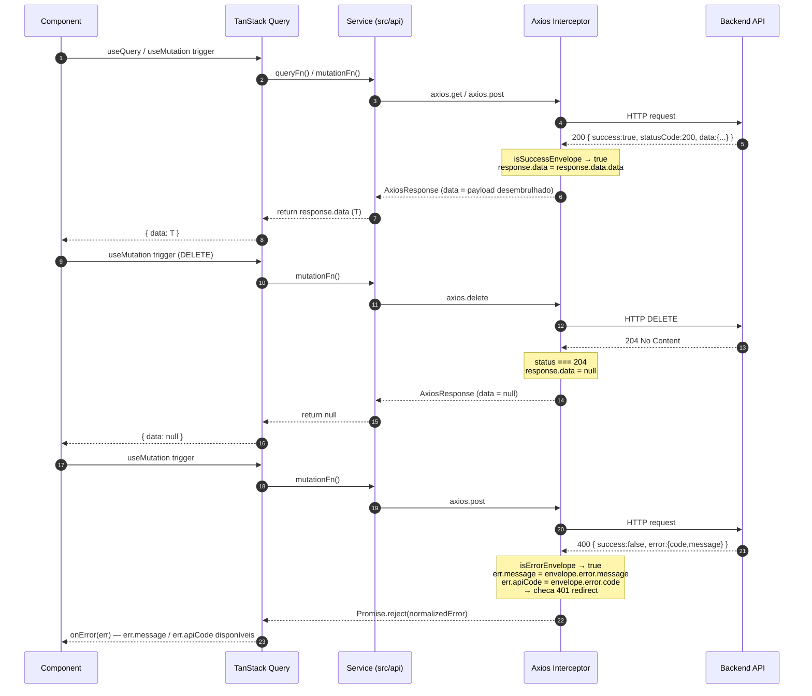

# API Envelope Adaptation — Design

## 1. Architecture Overview

A adaptação é uma mudança de ponto único: um par de interceptors em `src/lib/axios.ts` normaliza toda troca HTTP antes de chegar a qualquer código de aplicação. Service files, React Query hooks e componentes permanecem estruturalmente inalterados — exceto pela atualização mecânica do shape de erro descrita na §6.

```
Browser
  │
  ▼
Axios instance (src/lib/axios.ts)
  │
  ▼
Backend API
  │
  ▼
[SUCCESS interceptor]
  │  Recebe:  AxiosResponse<ApiSuccessEnvelope<T>>
  │  Muta:    response.data = envelope.data
  │  Retorna: AxiosResponse (response.data agora é T)
  │
  ▼
Service layer (src/api/**/*.ts)
  │  Retorna: response.data  ← já desembrulhado, sem mudança
  │
  ▼
TanStack Query (queryFn / mutationFn)
  │  Recebe T, armazena no cache
  │
  ▼
Component
     Lê data diretamente — sem mudança estrutural
```

```
[ERROR interceptor]
  │  Recebe:  AxiosError com response.data = ApiErrorEnvelope
  │  Normaliza: error.message = envelope.error.message
  │             error.apiCode  = envelope.error.code
  │  Rejeita:   Promise.reject(error)
  │
  ▼
TanStack Query onError / component catch
     Lê: err.message   (string legível)
         err.apiCode   (ApiErrorCode)
```

### Diagrama de sequência



---

## 2. Estrutura de Módulos

### Arquivo criado

**`src/types/api.ts`** (novo)

Centraliza todos os tipos que cruzam o fio HTTP. Separado de `src/lib/axios.ts` para que componentes e services possam importar tipos sem puxar a instância axios (evita imports circulares).

Exporta: `ApiSuccessEnvelope<T>`, `ApiErrorEnvelope`, `ApiErrorCode`, module augmentation de `AxiosError`.

### Arquivo reescrito

**`src/lib/axios.ts`**

| Responsabilidade | Onde |
|---|---|
| Criar instância axios | Topo do arquivo — inalterado |
| Guardar 204 No Content | Success interceptor — primeiro check |
| Guardar body não-envelope | Success interceptor — branch fallback |
| Desembrulhar `envelope.data` → `response.data` | Success interceptor — branch principal |
| Normalizar `err.message` do envelope | Error interceptor — primeira ação |
| Anexar `err.apiCode` do envelope | Error interceptor — segunda ação |
| Guardar body de erro não-envelope | Error interceptor — guard |
| Lógica de redirect 401 | Error interceptor — última ação |

---

## 3. Sistema de Tipos

### `src/types/api.ts` — conteúdo completo

```typescript
// ── Wire types ────────────────────────────────────────────────────────────────

export interface ApiSuccessEnvelope<T = unknown> {
  success: true
  statusCode: number
  data: T
  message?: string
}

export interface ApiErrorEnvelope {
  success: false
  statusCode: number
  error: {
    code: ApiErrorCode
    message: string
  }
}

// ── Error codes ───────────────────────────────────────────────────────────────

export type ApiErrorCode =
  | 'RESOURCE_NOT_FOUND'
  | 'INVALID_CREDENTIALS'
  | 'UNAUTHORIZED'
  | 'EMAIL_ALREADY_IN_USE'
  | 'PSYCHOLOGIST_NOT_FOUND'
  | 'PATIENT_NOT_FOUND'
  | 'APPOINTMENT_NOT_FOUND'
  | 'SLOT_ALREADY_BOOKED'
  | 'SLOT_NOT_AVAILABLE'
  | 'INVALID_APPOINTMENT_TIME'
  | 'APPOINTMENT_ALREADY_CANCELLED'
  | 'APPOINTMENT_ALREADY_CONFIRMED'
  | 'MISSING_GOOGLE_TOKENS'
  | 'INVALID_GOOGLE_TOKENS'
  | 'GOOGLE_CALENDAR_ERROR'
  | 'VALIDATION_ERROR'
  | 'INTERNAL_ERROR'

// ── Module augmentation ───────────────────────────────────────────────────────
// Estende AxiosError globalmente para incluir apiCode como propriedade tipada.
// Assim, err.apiCode é checado pelo TypeScript em qualquer catch block
// sem necessidade de cast por call site.

declare module 'axios' {
  interface AxiosError {
    apiCode?: ApiErrorCode
  }
}
```

### Decisão: module augmentation vs alternativas

**Escolhido: module augmentation.**

| Abordagem | Problema |
|---|---|
| Cast por site (`err as AxiosError & { apiCode?: ApiErrorCode }`) | Deve ser repetido em cada catch block; TypeScript não verifica se a propriedade foi realmente atribuída |
| Tipo de interseção local | Mesmo problema do cast — não inferido automaticamente por `axios.isAxiosError(err)` |
| **Module augmentation** | `apiCode` fica disponível em todo `AxiosError` do projeto; assignment no interceptor é type-checked; `isAxiosError` narrowing funciona automaticamente |

---

## 4. Decisões de Design do Interceptor

### `src/lib/axios.ts` — reescrita completa

```typescript
import axios from 'axios'
import type { ApiSuccessEnvelope, ApiErrorEnvelope } from '@/types/api'

export const api = axios.create({
  baseURL: import.meta.env.VITE_API_URL,
  withCredentials: true,
})

const SKIP_REDIRECT_PATHS = [
  '/sign-in',
  '/auth/google/success',
  '/auth/google/complete',
  '/google-oauth-success',
  '/google-oauth-complete',
]

function isSuccessEnvelope(body: unknown): body is ApiSuccessEnvelope {
  return (
    typeof body === 'object' &&
    body !== null &&
    (body as ApiSuccessEnvelope).success === true &&
    'data' in (body as object)
  )
}

function isErrorEnvelope(body: unknown): body is ApiErrorEnvelope {
  return (
    typeof body === 'object' &&
    body !== null &&
    (body as ApiErrorEnvelope).success === false &&
    typeof (body as ApiErrorEnvelope).error?.code === 'string'
  )
}

api.interceptors.response.use(
  (response) => {
    // 1. 204 No Content — body vazio, nada a desembrulhar
    if (response.status === 204) {
      response.data = null
      return response
    }

    // 2. Body é envelope — desembrulha data in-place
    if (isSuccessEnvelope(response.data)) {
      response.data = response.data.data
      return response
    }

    // 3. Body não-envelope (nginx 502 HTML, proxy, endpoint legado)
    //    Passa inalterado
    return response
  },

  (error) => {
    // 1. Normaliza message e apiCode do envelope PRIMEIRO
    if (axios.isAxiosError(error) && isErrorEnvelope(error.response?.data)) {
      const envelope = error.response!.data as ApiErrorEnvelope
      error.message = envelope.error.message
      error.apiCode  = envelope.error.code
    }

    // 2. Redirect 401 (lógica inalterada, roda após normalização)
    if (error.response?.status === 401) {
      localStorage.removeItem('isAuthenticated')
      localStorage.removeItem('user')
      const currentPath = window.location.pathname
      const shouldRedirect = !SKIP_REDIRECT_PATHS.some((p) => currentPath.startsWith(p))
      if (shouldRedirect) window.location.href = '/sign-in'
    }

    return Promise.reject(error)
  },
)
```

### Por que mutar `response.data` in-place

Retornar um novo objeto de response criaria uma cópia rasa. O axios passa a mesma referência de response pelo chain de interceptors, e propriedades como `config`, `headers`, `request` são sensíveis a referência internamente. A mutação in-place é o padrão convencional da documentação do axios e evita alocações desnecessárias por request.

### Por que type guards em vez de checar `response.status`

Checar `response.status === 200` falharia para 201, 202 e outros códigos de sucesso futuros. Mais importante: um check de status não diz nada sobre o shape do body — um 200 de nginx com HTML seria tratado como envelope. Os type guards inspecionam o body real, que é o invariante correto. São também unit-testáveis em isolamento.

### Por que normalização ANTES do redirect 401

O redirect 401 é um side effect de navegação. Se a normalização rodasse depois, qualquer código no mesmo frame síncrono após `window.location.href = '/sign-in'` receberia um erro não-normalizado. Rodando a normalização primeiro, ela é incondicional — todo erro com body de envelope é normalizado independente do status code. O branch 401 lê um erro com shape consistente.

### Como 204 é tratado com segurança

Axios pode setar `response.data` como `""`, `null` ou `undefined` dependendo do content-type e versão. A atribuição explícita `response.data = null` canonicaliza para `null`. Services que chamam endpoints DELETE tipicamente não usam o retorno; os que usam podem checar `data === null`.

### Como bodies não-envelope são tratados

Se `isSuccessEnvelope(response.data)` retorna false, o interceptor devolve a response inalterada. Service code recebe o body bruto — o mesmo comportamento de hoje. Safe fallback.

---

## 5. Shape do Erro: Antes vs Depois

### Antes do interceptor

```typescript
// err: AxiosError — o que chega em onError / catch hoje
{
  message: "Request failed with status code 400",  // inútil
  response: {
    status: 400,
    data: {
      success: false,
      statusCode: 400,
      error: { code: "SLOT_ALREADY_BOOKED", message: "Este horário já foi reservado" }
    }
  }
}

// Padrão de acesso atual nos componentes:
err.response?.data?.message   // undefined — quebrado com o novo backend
```

### Depois do interceptor

```typescript
// err: AxiosError (augmented)
{
  message: "Este horário já foi reservado",   // ← promovido do envelope
  apiCode: "SLOT_ALREADY_BOOKED",             // ← novo, tipado como ApiErrorCode
  response: {
    status: 400,
    data: { /* envelope original — preservado, não removido */ }
  }
}

// Padrão de acesso após a mudança:
err.message    // "Este horário já foi reservado"
err.apiCode    // "SLOT_ALREADY_BOOKED"
```

Para erros não-envelope (timeout, nginx 502):

```typescript
{
  message: "Network Error",  // default do axios — inalterado
  apiCode: undefined,         // não atribuído
  response: undefined | { status: 502, data: "<html>..." }
}
```

---

## 6. Padrão de Atualização nos Componentes

### Padrão A — os 10 arquivos simples

**Antes:**
```typescript
// catch block ou onError
toast.error(err.response?.data?.message || 'Ocorreu um erro')
```

**Depois:**
```typescript
toast.error(err.message || 'Ocorreu um erro')
```

Mudança puramente mecânica: `err.response?.data?.message` → `err.message`. Sem imports adicionais. O interceptor garante que `err.message` é a string humana do envelope sempre que o backend retornou um body de erro válido.

### Padrão B — `sign-up-form.tsx` (caso especial)

Este componente usa códigos de erro para decidir qual campo de formulário marcar inválido.

**Antes:**
```typescript
} catch (err: any) {
  const status = err.response?.status
  const message = Array.isArray(err.response?.data?.message)
    ? err.response.data.message[0]
    : err.response?.data?.message

  if (status === 409) {
    if (message === "EMAIL_ALREADY_EXISTS") {
      setError("email", { message: "E-mail já cadastrado" })
      toast.error("E-mail já cadastrado")
      return
    }
    if (message === "CPF_ALREADY_EXISTS") {
      setError("cpf", { message: "CPF já cadastrado" })
      toast.error("CPF já cadastrado")
      return
    }
  }
  toast.error("Erro ao realizar cadastro")
}
```

**Depois:**
```typescript
import axios from 'axios'

} catch (err: unknown) {
  if (!axios.isAxiosError(err)) return

  const code = err.apiCode  // ApiErrorCode | undefined

  if (code === 'EMAIL_ALREADY_IN_USE') {
    setError('email', { type: 'manual', message: 'E-mail já cadastrado' })
    toast.error('E-mail já cadastrado')
    return
  }

  // CPF: aguardando confirmação do backend (ver OQ-1 no spec.md)
  // Fallback cobre qualquer código não mapeado
  toast.error(err.message || 'Erro ao realizar cadastro')
}
```

**Notas:**
- O guard `Array.isArray` é removido — o novo backend envia um único `error.code` string.
- O check de status 409 é substituído por check de `apiCode` — mais preciso; não quebra se o backend mudar 409 para 422.
- `CPF_ALREADY_EXISTS` não existe no contrato de `ApiErrorCode` atual. Branch removido; o fallback toast cobre o cenário até confirmação do backend.

---

## 7. Alternativas Consideradas e Rejeitadas

### A — Custom wrapper function

```typescript
export async function apiCall<T>(promise: Promise<AxiosResponse<ApiSuccessEnvelope<T>>>): Promise<T> {
  const response = await promise
  return response.data.data
}
```

**Rejeitado:** Todos os 63 service files precisariam ser modificados. O interceptor resolve o mesmo problema sem tocar nenhum service file. O wrapper também não resolve a normalização de erros — cada catch block ainda precisaria aprofundar no envelope manualmente.

### B — React Query `select` para desembrulhar por query

```typescript
useQuery({ queryFn: () => api.get('/appointments'), select: (res) => res.data.data })
```

**Rejeitado:** `select` só se aplica a queries, não a mutations. Não resolve erros. Requer toque em cada `useQuery` — mais invasivo que o interceptor. `select` é a ferramenta certa para remodelar dados cacheados para uma view específica, não para remover um envelope de protocolo que deveria ser invisível para o código de aplicação.

### C — Error boundary global

**Rejeitado:** A maioria dos erros de API nesta aplicação são recuperáveis e contextuais — um booking falho deve mostrar um toast próximo ao form, não desmontar a página inteira. Error boundaries capturam erros de render, não async. TanStack Query já intercepta async errors via `onError` / `isError` na query — um boundary global não receberia nada por padrão.

---

## Resumo de Mudanças

| Arquivo | Ação | Escopo |
|---|---|---|
| `src/types/api.ts` | Criar | ~40 linhas — tipos + module augmentation |
| `src/lib/axios.ts` | Reescrever | interceptors — criação da instância inalterada |
| `src/pages/auth/components/sign-up-form.tsx` | Atualizar | ~15 linhas — branching por `apiCode` |
| 10 arquivos de componente | Atualizar | 1 linha cada — `err.response?.data?.message` → `err.message` |
| 63 arquivos em `src/api/` | Sem mudança | interceptor resolve transparentemente |
