# 03 — Mudanças das Features e Impacto no Frontend

> Este documento descreve o que mudou com as duas features principais e como o frontend deve se adaptar.  
> Tudo aqui foi verificado no código real. Divergências entre spec e código estão explicitadas.

---

## Visão geral

Dois refactorings foram aplicados ao backend:

1. **DER Alignment Refactor** — alinhamento do schema ao DER oficial. Criou novas entidades (`PsychologistPracticeContext`, `PatientProfile`, entidades clínicas), removeu discriminadores monolíticos e separou identidade de perfil profissional.

2. **Auth / Profile / Context Refactor** — separou o registro em etapas independentes, criou `PracticeContextGuard` centralizado, moveu `consultationFee` para `PracticeContext` e tornou `PatientProfile.psychologistPracticeContextId` nullable.

---

## Antes vs depois — principais mudanças

| Aspecto | Antes | Depois |
|---|---|---|
| Criação de psicólogo | `POST /psychologist` (tudo em uma rota) | `POST /user` + `POST /psychologist/profile` + `POST /psychologist/practice-contexts` |
| Criação de paciente (self) | Não existia | `POST /patient/profile` |
| Vínculo paciente-psicólogo | Via `userId` direto | Via `PatientProfile.psychologistPracticeContextId` (nullable) |
| `consultationFee` | Em `PsychologistProfile` | Em `PsychologistPracticeContext` |
| Contexto de prática | Não existia | `PsychologistPracticeContext` (INDIVIDUAL ou CLINIC) |
| Validação de contexto | 25 controllers faziam validação manual por header | `PracticeContextGuard` centralizado |
| `PatientProfile.contextId` | Obrigatório | **Nullable** (paciente autônomo possível) |
| Entidades clínicas | Não existiam | `Clinic`, `ClinicBranch`, `ClinicMember`, `ClinicPsychologist` |

---

## Modelo de relacionamento atual

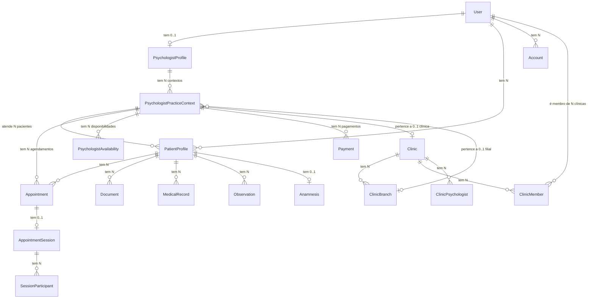

---

## Mudanças no modelo de identidade

### Antes (monolítico)

```
User { type: UserType, ...psichologistFields, ...patientFields }
```

### Depois (separado)

```
User { platformRole: PlatformRole } 
  → PsychologistProfile (0..1)
    → PsychologistPracticeContext (N)
  → PatientProfile (N, cada um linked a 1 contexto ou null)
  → ClinicMember (N)
```

**O que isso significa para o frontend:**
- `platformRole` serve para identificar `ADMIN`/`SUPPORT`. Para tudo mais, use os perfis.
- Um único usuário pode ser simultaneamente paciente E psicólogo.
- Um psicólogo pode ter múltiplos contextos de prática (ex: consultório próprio + clínica).
- Um paciente pode estar vinculado a diferentes psicólogos via diferentes `PatientProfile`s.

---

## Mudanças em User

| Campo | Mudança |
|---|---|
| `platformRole` | **Novo** — substitui `UserType` (legado removido) |
| `email` | Passou a ser nullable (permite OAuth sem email) |
| Campos de psicólogo | **Removidos** do User — agora em `PsychologistProfile` |
| Campos de paciente | **Removidos** do User — agora em `PatientProfile` |

---

## Mudanças em Account

| Campo | Mudança |
|---|---|
| `status` | ✅ `ACTIVE` no registro (T29 + fix do fluxo de credenciais) — sem aprovação. `Account.create` default `ACTIVE`; `POST /user`, OAuth e invite-link gravam `ACTIVE` |
| `isActive` | ✅ `true` no registro (credenciais/OAuth/invite gravam conta ativa) |
| `provider` | Passou a aceitar múltiplos providers por usuário |
| `status` retornado em `POST /session` | **Novo** — frontend pode checar imediatamente após login |

---

## Mudanças em PsychologistProfile

| Campo | Mudança |
|---|---|
| `consultationFee` | **Removido** — movido para `PsychologistPracticeContext` |
| `status` | ✅ `ACTIVE` por default (T29) — sem aprovação admin |
| `professionalBio` | ✅ Exposto em `GET /me` (no `psychologistProfile`) |

---

## Mudanças em PsychologistPracticeContext

**Entidade nova.** Não existia antes.

| Campo | Observação |
|---|---|
| `consultationFee` | **Movido de Profile** — em centavos |
| `nickname` | **Novo** — identificador amigável |
| `contextType` | `INDIVIDUAL` ou `CLINIC` |
| `clinicId` / `clinicBranchId` | Nullable — obrigatório se `CLINIC` |

---

## Mudanças em PatientProfile

**Entidade nova (substituiu campos em User/Patient legado).**

| Campo | Observação |
|---|---|
| `psychologistPracticeContextId` | **Nullable** — paciente pode existir sem vínculo |
| `archivedAt` | Novo campo para arquivamento soft |

---

## Mudanças na autenticação

### Fluxo de login

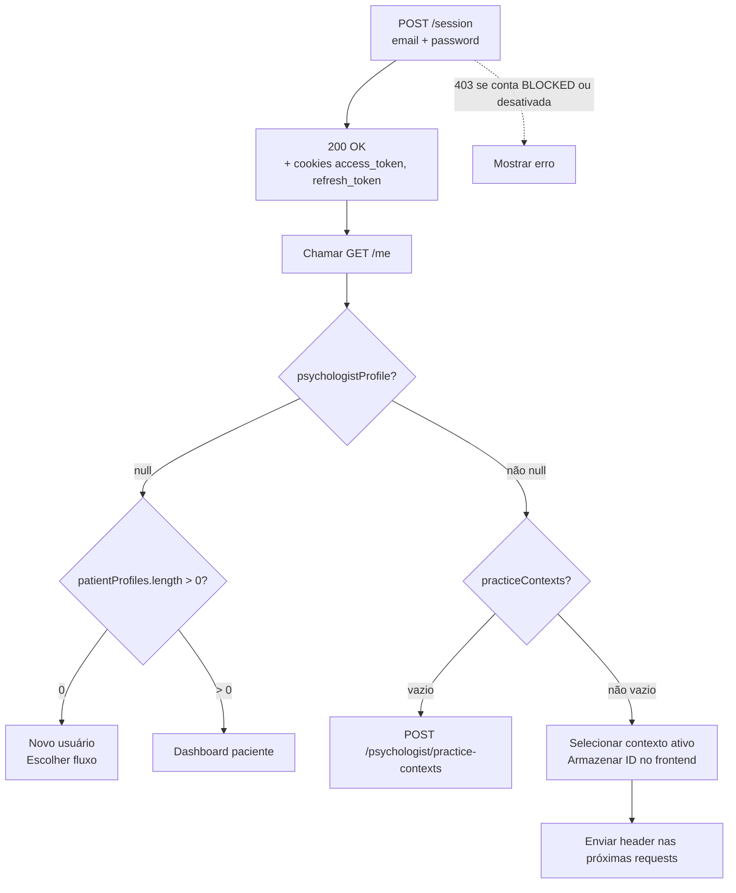

### Payload JWT atual

```ts
{
  sub: string,          // users.id
  email: string,
  provider: string,     // 'credentials' | 'google' | 'linkedin'
  profileImageUrl: string | null
}
```

> **Nota:** O payload **não contém** `platformRole`, `psychologistProfileId`, ou qualquer dado de perfil. Use `GET /me` para obter essas informações.

---

## Mudanças no GET /me

### O que retorna hoje

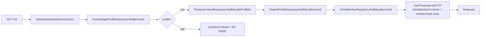

### Campos em GET /me (✅ todos expostos — T27)

| Campo | Está no banco? | Aparece em GET /me? |
|---|---|---|
| `psychologistProfile.professionalBio` | ✅ | ✅ Incluído |
| `practiceContexts[].consultationFee` | ✅ | ✅ Incluído |
| `practiceContexts[].nickname` | ✅ | ✅ Incluído |
| `clinicMemberContexts` | ✅ | ✅ Memberships reais via `ClinicMemberRepository` |

---

## Fluxo de seleção de perfil

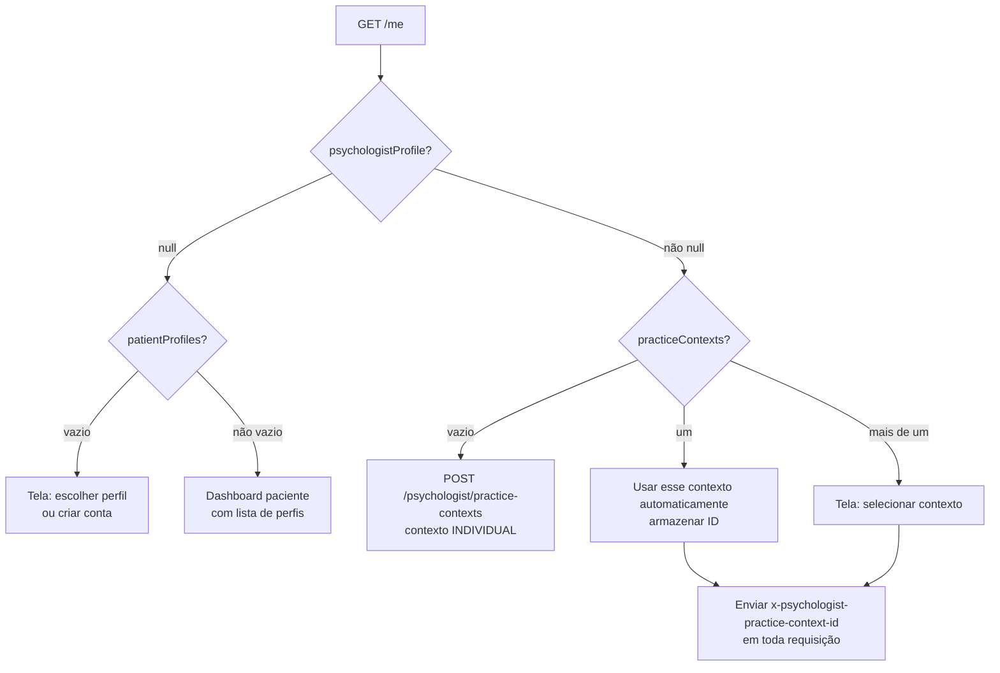

---

## Fluxo de criação de conta base

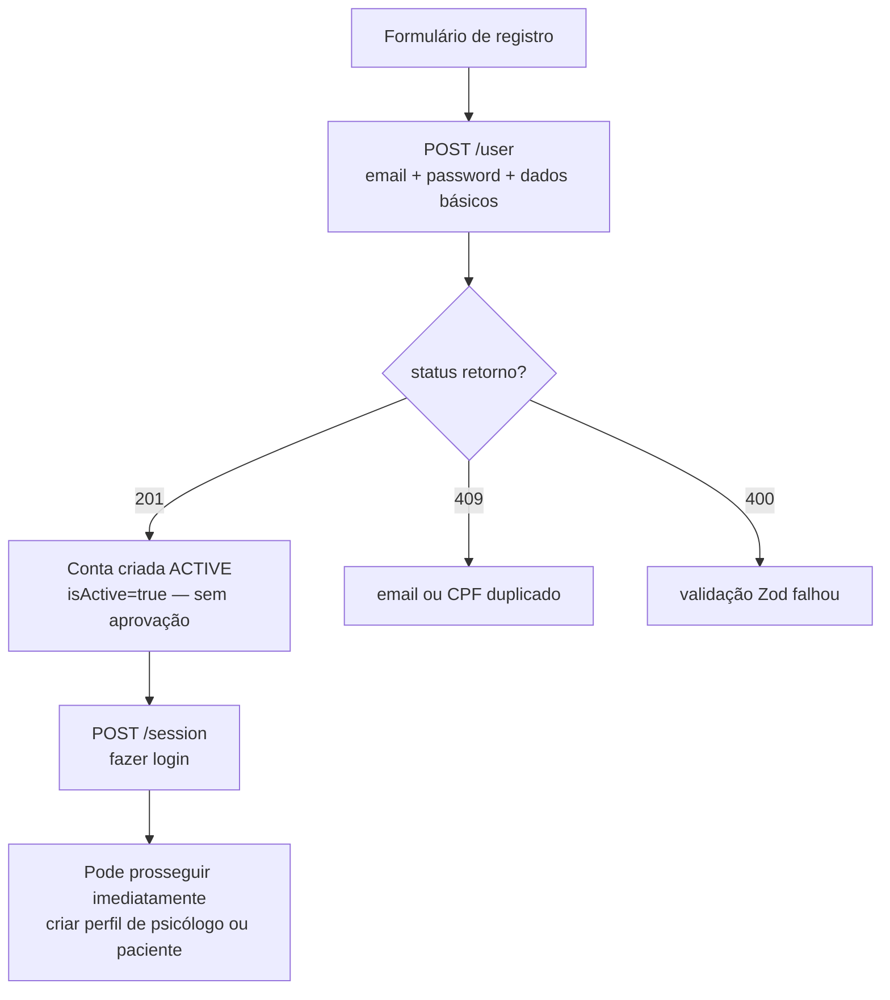

> ✅ **Self-service sem aprovação:** Um usuário recém-registrado via `POST /user` recebe conta `ACTIVE` e pode logar e criar perfil de psicólogo (`POST /psychologist/profile`) ou paciente (`POST /patient/profile`) de imediato. O `AccountStatusGuard` só bloqueia contas `BLOCKED` ou desativadas (`isActive=false`).

---

## Fluxo de criação de perfil de psicólogo

```mermaid
flowchart TD
    A[POST /psychologist/profile\ncredenciais + JWT] --> B[AccountStatusGuard]
    B --> C{account ACTIVE?}
    C -->|não \(BLOCKED/desativada\)| D[403 Forbidden]
    C -->|sim| E[CreatePsychologistProfileUseCase]
    E --> F{CRP já existe?}
    F -->|sim| G[409 CRP_ALREADY_EXISTS]
    F -->|não| H[Cria perfil com status=ACTIVE]
    H --> I[Resposta 201\nstatus=ACTIVE]
    I --> M[OK — pode criar contextos imediatamente]
```

> ✅ **Sem dupla aprovação:** A conta nasce `ACTIVE` e o `PsychologistProfile` é criado já `ACTIVE`. Não há etapa de aprovação manual — o psicólogo segue direto para criar contextos de atuação. (O `AccountStatusGuard` ainda bloqueia perfis `BLOCKED`/desativados e planos expirados.)

---

## Fluxo de criação de contexto de atuação

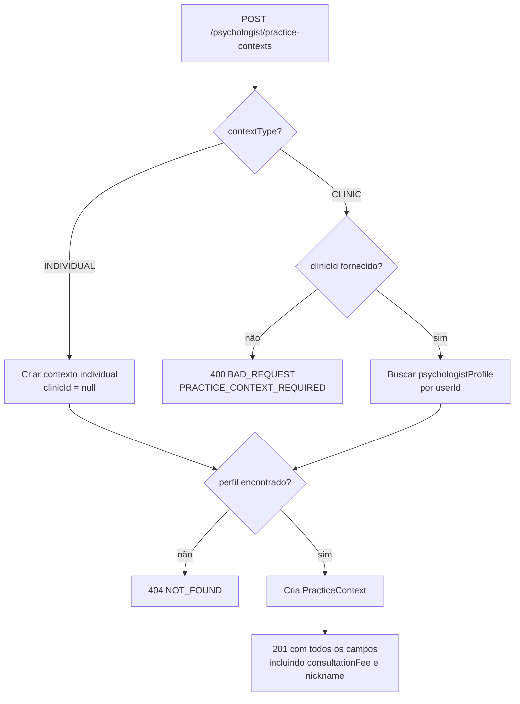

---

## Fluxo de criação de PatientProfile (self-service)

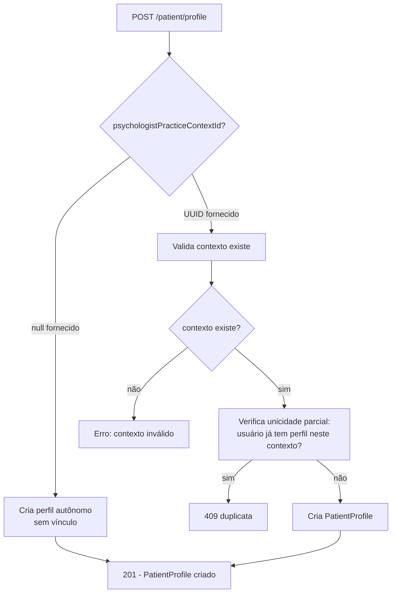

---

## Fluxo de seleção de contexto ativo e envio do header

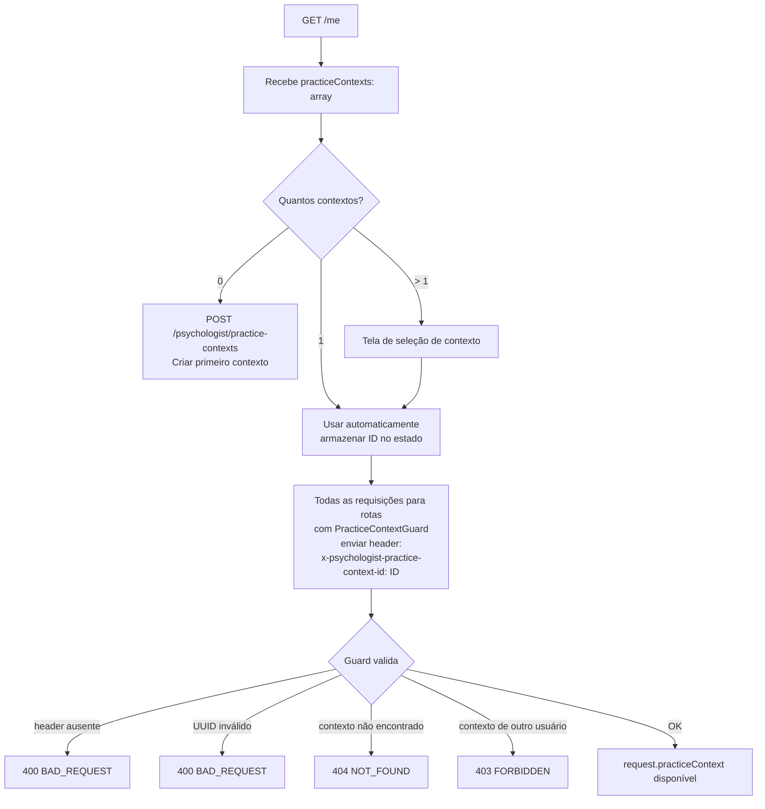

---

## Fluxo de paciente criado pelo psicólogo via POST /patient

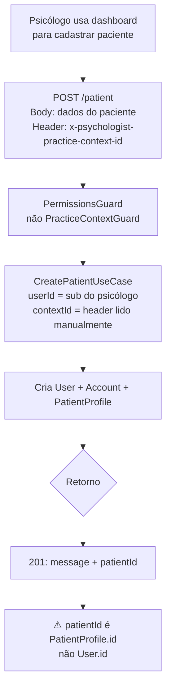

---

## Fluxo de convite (link de registro)

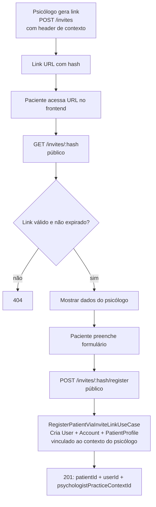

---

## Fluxo de rotas com PracticeContextGuard

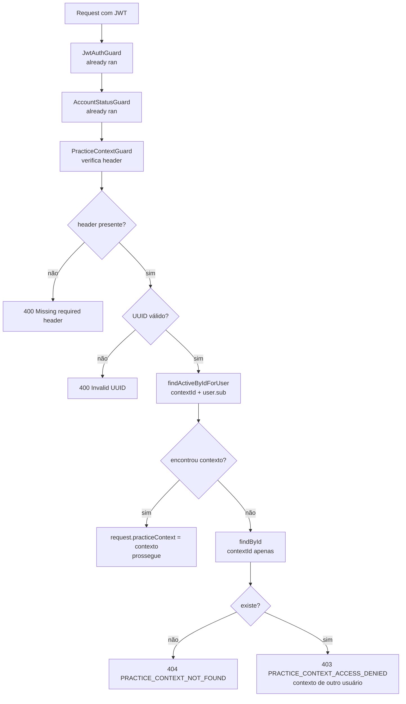

---

## Mudanças em appointments

- `psychologistPracticeContextId` na tabela é nullable (antes era obrigatório via `userId` direto).
- `patientProfileId` na tabela também é nullable.
- ✅ Enum `AppointmentStatus` alinhado ao Prisma (T31) — `DONE` removido do domínio; use os 6 valores: `SCHEDULED`, `ATTENDING`, `FINISHED`, `CANCELED`, `NOT_ATTEND`, `RESCHEDULED`.
- Todas as rotas de agendamento exigem `PracticeContextGuard` exceto `GET /appointments/context/:practiceContextId`.

---

## Mudanças em documentos / prontuários / observações / anamnese

- Todas as entidades (`Document`, `MedicalRecord`, `Observation`) são scoped por `PatientProfile`, não por `User`.
- Rotas de documentos exigem `PracticeContextGuard`.
- ✅ `AnamnesisController` usa `@UseGuards(JwtAuthGuard, PracticeContextGuard)` — isolamento por contexto.
- O `:patientId` em `/patients/:patientId/anamnesis` é tratado como `patientProfileId` no código.

---

## Mudanças em clínicas

- Entidades `Clinic`, `ClinicBranch`, `ClinicMember`, `ClinicPsychologist` foram criadas (P2).
- ✅ `GET /me` retorna `clinicMemberContexts` reais via `ClinicMemberRepository.findManyByUserId`.
- Controllers de clínica estão registrados mas sem guards rigorosos de ownership.

---

## Mudanças em billing

- `consultationFee` saiu de `PsychologistProfile` e foi para `PsychologistPracticeContext`.
- `AccountStatusGuard` verifica `Payment` ativo para psicólogos com contexto INDIVIDUAL.
- `POST /billing` retorna URL de pagamento externo — incerto se cria `Payment` local.
- Se não criar `Payment` local, o psicólogo ficará bloqueado mesmo após pagar.

---

## Impacto no dashboard de paciente

| Recurso | Status |
|---|---|
| Listar agendamentos | ⚠️ Não há rota de agendamentos para paciente — apenas para psicólogo |
| Ver documentos próprios | ⚠️ Rotas exigem `PracticeContextGuard` (do psicólogo) |
| Ver anamnese | ✅ Funciona via `GET /patients/:patientProfileId/anamnesis` |
| Perfil de usuário | ✅ `GET /me` |

---

## Impacto no dashboard de psicólogo

| Recurso | Status |
|---|---|
| `consultationFee` | ✅ Em `POST /psychologist/practice-contexts` **e** em `GET /me` (por contexto) |
| `nickname` do contexto | ✅ Em `POST /psychologist/practice-contexts` **e** em `GET /me` |
| `professionalBio` | ✅ Em `POST /psychologist/profile` **e** em `GET /me` |
| `clinicMemberContexts` | ✅ Memberships reais em `GET /me` (via `ClinicMemberRepository`) |
| Agendamentos | ✅ Funciona com `PracticeContextGuard` |
| Pacientes | ✅ `GET /patients` com header |
| Dashboard data | ✅ `GET /dashboard` com `PracticeContextGuard` + header — escopado por practice context |

---

## Impacto em cache / state management do frontend

### O que armazenar após GET /me

```ts
interface FrontendUserState {
  // Identidade
  id: string
  firstName: string
  lastName: string
  email: string | null
  profileImageUrl: string | null
  platformRole: string
  
  // Perfil psicólogo
  psychologistProfile: {
    id: string
    crp: string
    expertise: string
    status: string     // verificar se ACTIVE antes de usar dashboard
    isActive: boolean
    // ⚠️ professionalBio NÃO vem aqui — buscar separado se necessário
  } | null
  
  // Contextos de prática (⚠️ consultationFee e nickname NÃO vêm aqui)
  practiceContexts: Array<{
    id: string
    contextType: string
    clinicId: string | null
    clinicBranchId: string | null
    isActive: boolean
  }>
  
  // Contexto ativo selecionado pelo usuário (gerenciado pelo frontend)
  activePracticeContextId: string | null
  
  // Perfis de paciente
  patientProfiles: Array<{
    id: string
    psychologistPracticeContextId: string | null
    isActive: boolean
  }>
  
  // ⚠️ clinicMemberContexts sempre vem vazio — não usar
}
```

### Quando invalidar o cache

| Evento | Ação |
|---|---|
| Login (`POST /session`) | Chamar `GET /me` imediatamente após |
| `POST /psychologist/profile` | Recarregar `GET /me` |
| `POST /psychologist/practice-contexts` | Recarregar `GET /me` (ou atualizar `practiceContexts` local) |
| `POST /patient/profile` | Recarregar `GET /me` (ou atualizar `patientProfiles` local) |
| Troca de contexto ativo | Apenas atualizar `activePracticeContextId` local |
| Logout | Limpar todo o estado |

---

## Regras práticas para o frontend

### Como decidir o papel do usuário

```ts
function getUserRole(meResponse: MeResponse) {
  const isPsychologist = meResponse.psychologistProfile !== null
  const isPatient = meResponse.patientProfiles.length > 0
  
  if (isPsychologist && isPatient) return 'BOTH'
  if (isPsychologist) return 'PSYCHOLOGIST'
  if (isPatient) return 'PATIENT'
  return 'NEW_USER'
}
```

### Como enviar o contexto ativo

```ts
// Em toda request para rota com PracticeContextGuard
headers: {
  'x-psychologist-practice-context-id': activePracticeContextId
}
```

### Como tratar PatientProfile sem contexto

- `psychologistPracticeContextId: null` = paciente autônomo
- Mostrar como "perfil geral" ou "conta independente"
- Este perfil NÃO está vinculado a nenhum psicólogo específico

### Status de conta e perfil

- ✅ Registro nasce `ACTIVE` (conta e `PsychologistProfile`) — sem aprovação manual. Não há estado `PENDING` no fluxo normal.
- O `AccountStatusGuard` só retorna 403 quando: conta `BLOCKED`, conta desativada (`isActive=false`), perfil de psicólogo `BLOCKED`/desativado, ou plano (contexto INDIVIDUAL) expirado.
- A mensagem de erro de plano expirado é tratada separadamente das de conta/perfil suspensos.

### Como tratar respostas envelopadas

```ts
// Sucesso
const response = await fetch('/me', ...)
const { success, data, error } = await response.json()
if (!success) {
  throw new Error(error.code) // ex: 'PRACTICE_CONTEXT_NOT_FOUND'
}
// usar data

// ⚠️ Exceção: POST /session e POST /session/refresh NÃO são envelopados
const sessionResponse = await response.json()
// Direto: sessionResponse.user, sessionResponse.message
```

### Como tratar erro 400 de Zod

```json
{
  "success": false,
  "statusCode": 400,
  "data": null,
  "error": {
    "code": "BAD_REQUEST",
    "message": "[ { path: ['email'], message: 'Invalid email' } ]"
  }
}
```

O `message` pode conter o array de erros do Zod serializado como string.

### Como tratar erro 403 do AccountStatusGuard

```json
{
  "success": false,
  "statusCode": 403,
  "error": {
    "code": "FORBIDDEN",
    "message": "Sua conta foi permanentemente suspensa por violação dos termos de uso."
  }
}
```

> Mensagens possíveis: conta desativada, conta `BLOCKED`, perfil suspenso, ou plano expirado. **Não** há mais "conta em aprovação" no fluxo de registro (registro nasce `ACTIVE`).

Verificar `error.code === 'FORBIDDEN'` + a mensagem para distinguir de outros 403.

### Como tratar erros do PracticeContextGuard

| Situação | Status | Code |
|---|---|---|
| Header ausente | 400 | `BAD_REQUEST` |
| UUID inválido | 400 | `BAD_REQUEST` |
| Contexto não existe | 404 | `NOT_FOUND` |
| Contexto de outro usuário | 403 | `FORBIDDEN` |

---

## Fluxos recomendados (novo)

### Fluxo completo de onboarding de psicólogo

```
1. POST /user                        → Criar conta (status: ACTIVE, sem aprovação)
2. POST /session                     → Login (funciona imediatamente)
3. GET /me                           → Verificar estado atual
4. POST /psychologist/profile        → Criar perfil (status: ACTIVE)
5. POST /psychologist/practice-contexts → Criar contexto INDIVIDUAL
6. Armazenar context.id localmente   → Usar em todas as requests
7. POST /billing                     → Pagar assinatura
```

### Fluxo completo de onboarding de paciente (self-service)

```
1. POST /user                        → Criar conta (status: ACTIVE, sem aprovação)
2. POST /session                     → Login
3. POST /patient/profile             → Criar perfil (com contextId=null)
4. GET /me                           → Verificar patientProfiles
```

---

## Fluxos antes quebrados ou ambíguos — ✅ resolvidos

| Fluxo | Resolução |
|---|---|
| Auto-aprovação no registro | ✅ Registro nasce `ACTIVE` (T29 + fix do fluxo de credenciais) — sem aprovação manual |
| Psicólogo acessar dashboard após registro | ✅ Sem bloqueio: conta e perfil `ACTIVE` de imediato |
| `DELETE /patients/:id` | ✅ Migrada para `PatientProfileRepository` (stub deletado em T33) |
| Rotas de métricas de pacientes (`/patients/stats/*`) | ✅ Migradas para `PatientProfileRepository` |
| `GET /psychologists/:cpf|crp|email|id` | ✅ Colisão resolvida (T20); rotas `:cpf/:crp/:email` removidas (T33); use `search` |
| `AnamnesisController` sem `PracticeContextGuard` | ✅ `PracticeContextGuard` aplicado |
| `GET /me` e dados de clínica | ✅ `clinicMemberContexts` reais via `ClinicMemberRepository` |
| Billing → Pagamento → Acesso | ⚠️ Em aberto — incerto se `POST /billing` cria `Payment` local (D20) |

---

## Divergências entre specs e código

| # | Spec | Status |
|---|---|---|
| 1 | Fluxo self-service funciona sem aprovação | ✅ Resolvido — registro `ACTIVE`, guard não bloqueia novos usuários |
| 2 | `GET /me` expõe `consultationFee`, `nickname`, `professionalBio` | ✅ Resolvido — todos expostos |
| 3 | `clinicMemberContexts` populado | ✅ Resolvido — memberships reais |
| 4 | `AppointmentStatus.DONE` | ✅ Resolvido — `DONE` removido (T31) |
| 5 | `POST /psychologist` deprecado | ✅ Resolvido — rota removida (T33) |
| 6 | `PatientProfile` partial unique index via SQL raw | ✅ Confirmado na migration |

---

## Riscos de implementação

| Risco | Severidade | Status |
|---|---|---|
| CORS sem `x-psychologist-practice-context-id` | — | ✅ Resolvido (T28) — header no `allowedHeaders` |
| AccountStatusGuard duplo bloqueio | — | ✅ Resolvido — registro `ACTIVE`, sem aprovação |
| `PrismaPatientRepository` stub | — | ✅ Resolvido (T33) — stub deletado, rotas migradas |
| Billing sem Payment local | **ALTA** | ⚠️ Em aberto — confirmar se `POST /billing` cria `Payment` (D20) |
| Colisão de rotas `/psychologists/:param` | — | ✅ Resolvido (T20/T33) |
| `DONE` em AppointmentStatus | — | ✅ Resolvido (T31) — removido |
| Anamnese sem PracticeContextGuard | — | ✅ Resolvido — guard aplicado |
| `consultationFee`/`nickname` ausentes em `/me` | — | ✅ Resolvido — expostos em `/me` |

---

## Checklist para o frontend

### Autenticação

- [ ] `POST /session` retorna objeto cru (sem envelope) — tratar separadamente
- [ ] Tratar 403 de login apenas para conta `BLOCKED`/desativada (registro normal nasce `ACTIVE`)
- [ ] Implementar refresh automático de token com `POST /session/refresh`
- [ ] Enviar cookies com `credentials: 'include'` em todas as requests

### Identificação de perfil

- [ ] Usar `psychologistProfile !== null` para identificar psicólogo
- [ ] Usar `patientProfiles.length > 0` para identificar paciente
- [ ] Não usar `platformRole` para discriminar tipo de usuário
- [ ] Armazenar `activePracticeContextId` no estado local do frontend

### Context Guard

- [ ] Adicionar `x-psychologist-practice-context-id` a todos os headers permitidos pelo CORS no backend (ou aguardar correção)
- [ ] Tratar erro 400 por header ausente
- [ ] Tratar erro 404 por contexto não encontrado
- [ ] Tratar erro 403 por contexto de outro usuário

### AccountStatusGuard

- [ ] Tratar 403 de conta `BLOCKED`/desativada
- [ ] Tratar 403 de perfil suspenso
- [ ] Tratar 403 com mensagem de plano expirado

### Campos em GET /me

- [x] `professionalBio` — ✅ incluído no `psychologistProfile`
- [x] `consultationFee`, `nickname` — ✅ incluídos por contexto em `practiceContexts`
- [x] `clinicMemberContexts` — ✅ memberships reais

### Rotas removidas (não usar)

- [ ] `POST /psychologist`, `POST /auth/complete-registration` — removidas (T33), usar novo fluxo
- [ ] `GET /psychologists/:cpf|:crp|:email`, `GET /patients/:name` — removidas; usar `GET /psychologists/search`
- [ ] `GET /approvals`, `PATCH /approvals/:id/approve` — removidas (sem aprovação)

> As rotas antes "stub/quebradas" (`DELETE /patients/:id`, `/patients/stats/*`, métricas) foram **reparadas** (T33).

### Anamnese

- [ ] Passar `patientProfile.id` (não `user.id`) no path `/patients/:patientId/anamnesis`

### Pagamentos

- [ ] Verificar se `POST /billing` criou `Payment` local antes de assumir acesso liberado
